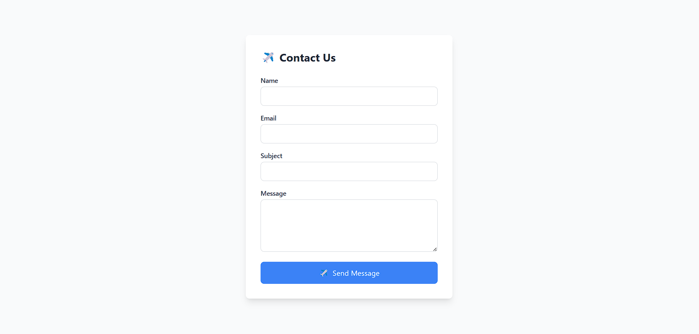

# Contact Form with Validation

This project is a simple contact form built with HTML, Tailwind CSS, and JavaScript. The form validates user input, provides error messages for invalid fields, and displays a thank-you message upon successful submission.

## Features

- Validates input fields: **Name**, **Email**, **Subject**, and **Message**.
- Displays error messages for empty or invalid fields.
- Shows a thank-you message upon successful submission.
- Includes a reset functionality to clear the form and restart.

## Files

- `index.html`: Contains the HTML structure of the contact form.

- `index.js`: Handles form validation and interactivity.

## How to Use

1. Clone or download the repository.
2. Open the `index.html` file in your browser.
3. Fill in the form fields.
4. Submit the form to see validation in action.
5. Reset the form to start over.

## Validation Rules

1. **Name**: Required field.
2. **Email**: Required field. Must contain `@` and `.` symbols.
3. **Subject**: Required field.
4. **Message**: Required field.

## File Details

### index.html
Defines the structure of the contact form with input fields, error message containers, and a thank-you message.

### index.js
Implements input validation and handles form submission and reset functionality.

## Demo
You can create a local demo by opening the `index.html` file in a browser.

## Screenshot

## Customization
- Extend the `index.js` file to add more validation rules or interactivity.

